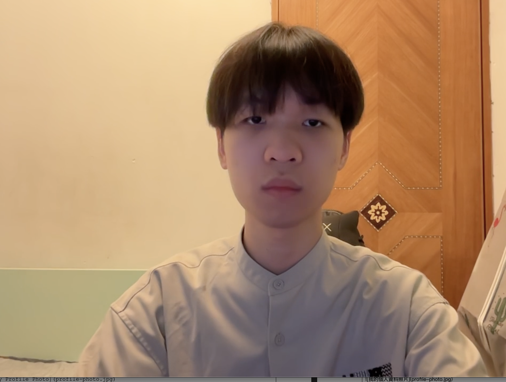

# Cheung King Lam
## About Me
I am a student at Hong Kong Polytechnic University, currently focusing on interactive simulations and VR development. I am passionate about using technology to enhance training and safety awareness.

Email: 24027544d@connect.polyu.hk

## Skills
* **Game Development:** Unity, C#
* **3D & VR:** Blender, VR Integration, Map Modeling
* **Tools:** Git, Google Maps (for terrain data)

## Past Projects/Achievement
**Interactive Simulation and Training for Driving Skills**
A Unity-based Final Year Project (FYP) designing a realistic driving simulator for the Shatin Ngan Shing route. The project integrates VR technology to enhance road safety awareness and prepare students for driving tests.

[View Project Code](https://github.com/yourusername/driving-sim)